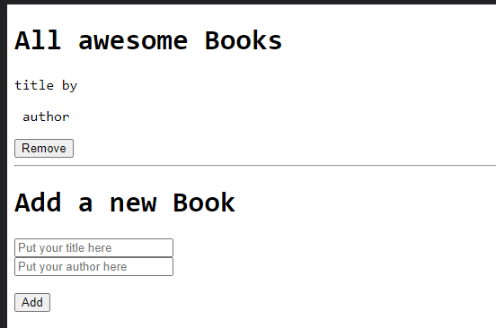

# BooksCollectionJS

Books Collection is a website where you can organize your books and create new items. this repo is for educational purpose

## Built With

- HTML
- CSS
- JavaScript

## Live Demo

[Live Demo Link](https://raw.githack.com/jacobo12montes/BooksCollectionJS/main/index.html)

## Getting started

### Prerequisites

- Browser (Google Chrome, Mozilla Firefox, Safari or any other browser)
- Text editor (strongly recommended VS Code)
- Empty directory where the repo is to be cloned

### To get a local copy of this repo

Run the following commands in the terminal in the next order:

- Step 1:  
  $ cd "here comes the path of your selected directory (double quotes must not be here)"

- Step 2:
  $ git clone https://github.com/jacobo12montes/BooksCollectionJS.git

### To run this project in your local environment

- Step 1:
  Open index.html file in a browser.

- Step 2:
  Try it on!

### How to use the aplication

- Step 1:
  Fill the form.

- Step 2:
  You can remove your books from the table clicking on " X ".

## Authors

👤  **Juan Jacobo Hincapie**

- Gmail: [@gmail](jacobo12.montes@gmail.com)
- Github: [@githubhandle](https://github.com/jacobo12montes)
- Twitter: [@twitterhandle](https://twitter.com/HincapieMontes)
- Linkedin: [linkedin](https://www.linkedin.com/in/juan-jacobo-hincapi%C3%A9-montes-93975210b/)

## 🤝 Contributing

Contributions, issues, and feature requests are welcome!

Feel free to check the [issues page](https://github.com/jacobo12montes/AwesomeBooksJS/issues).

## Show your support

Give a ⭐️ if you like this project!

## Acknowledgments

## 📝 License

This project is [MIT](./MIT.md) licensed.
